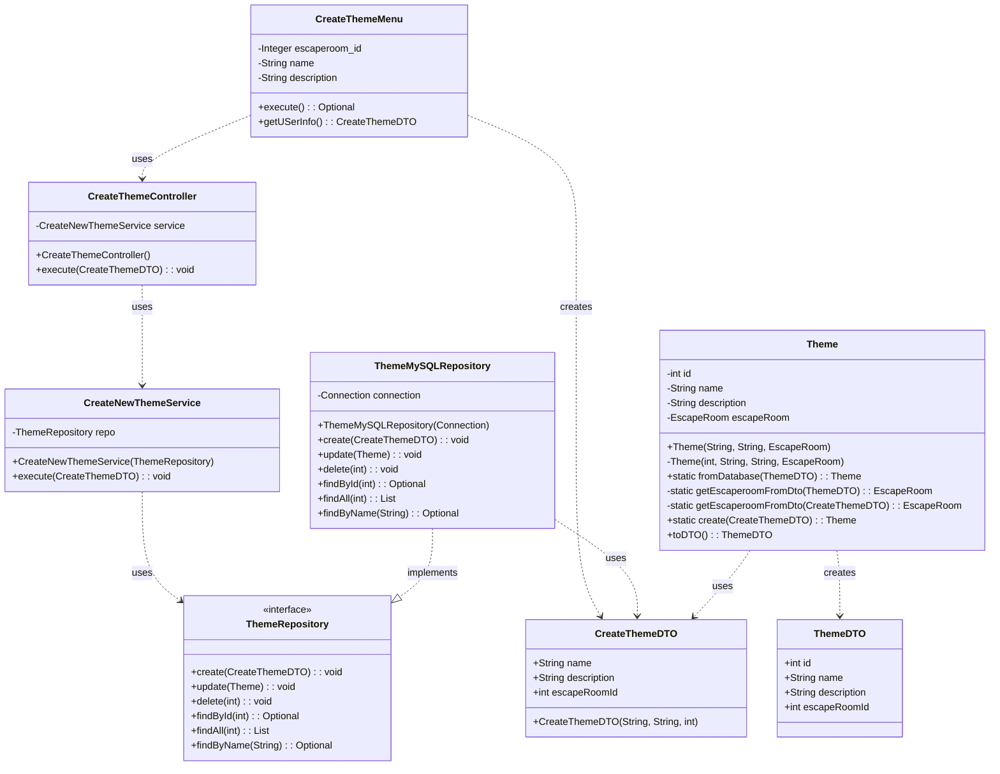
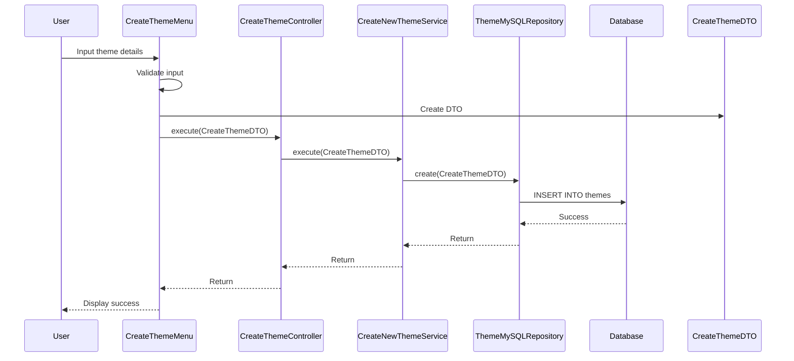

# Create Theme Use Case UML Diagram

## Sequence Diagram for Create Theme Use Case

## Component Descriptions

### Frontend
- **CreateThemeMenu**: User interface component that collects theme details from the user, validates them, and creates a CreateThemeDTO to pass to the controller.

### API Layer
- **CreateThemeController**: Acts as an intermediary between the frontend and the business logic. It instantiates the repository and service, and delegates the execution to the service.

### Business Logic
- **CreateNewThemeService**: Contains the business logic for creating a new theme. It receives a CreateThemeDTO and passes it to the repository.
- **Theme**: Domain object representing a theme with properties like id, name, description, and associated escape room.

### Data Access
- **ThemeRepository**: Interface defining methods for theme data operations.
- **ThemeMySQLRepository**: Implementation of ThemeRepository that interacts with a MySQL database.

### Data Transfer Objects
- **CreateThemeDTO**: DTO containing data needed to create a new theme (name, description, escapeRoomId).
- **ThemeDTO**: DTO representing a theme with all its properties (id, name, description, escapeRoomId).